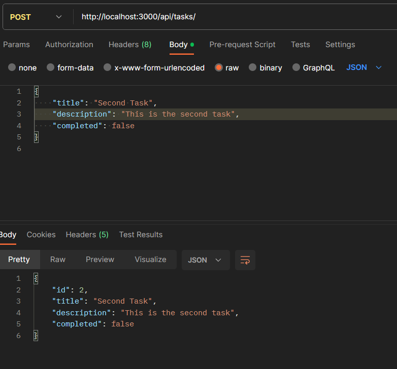
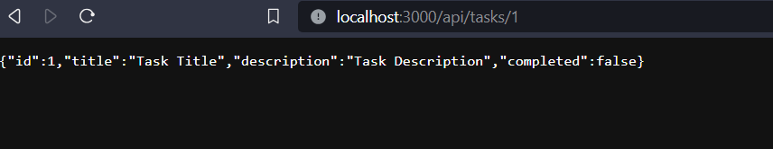
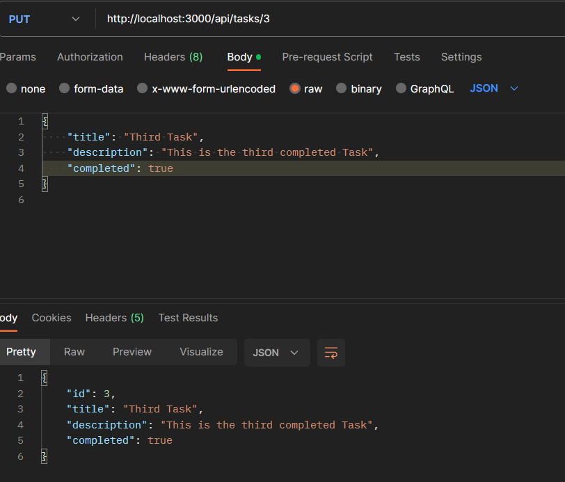
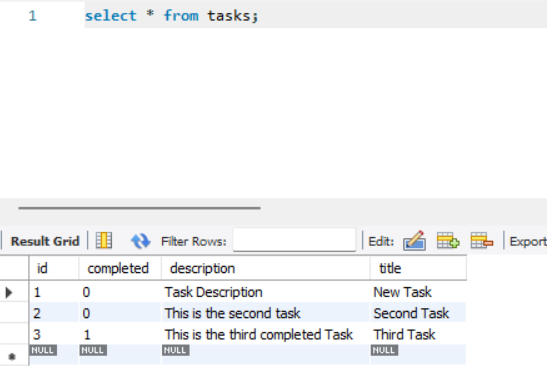

# Task Manager Application

This repository contains a Spring Boot project for managing tasks using Spring Web, Spring Data JPA, and MySQL.

## Getting Started

Follow these steps to set up and run the application locally:

1. **Clone the repository:**
    ```bash
    git clone https://github.com/your-username/TaskManager.git
    ```

2. **Setup MySQL:**
   - Start your SQL server and ensure it is running on port 3306.
   - Create a database named `task`.

3. **Run the Spring Boot Application:**
   - Open the project in your preferred IDE.
   - Build and run the Spring Boot application.
   - Make changes in the application.properties according to your username and password.

4. **Using Postman:**
   - Use Postman for making POST, PUT, and DELETE requests to interact with the application's REST endpoints.

5. **Sample Images:**
   Below are some images demonstrating the working of the application.

   **Post query using postman:**
   <br><br><br>

    **Get query using browser:**
   <br.<br><br>

   **PUT query using postman:**
    <br><br><br>

   <br>
   **SQL Table**
    

   

